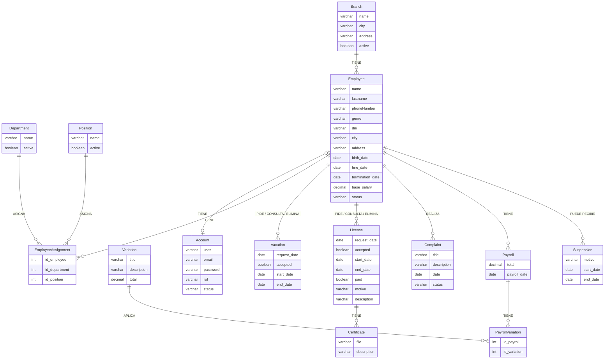

```mermaid

erDiagram
%% Entidades y Atributos
Account {
varchar user
varchar email
varchar password
varchar rol
varchar status
}

    Branch {
        varchar name
        varchar city
        varchar address
        boolean active
    }

    Variation {
        varchar title
        varchar description
        decimal total
    }

    Payroll {
        decimal total
        date payroll_date
    }

    Department {
        varchar name
        boolean active
    }

    Position {
        varchar name
        boolean active
    }

    Employee {
        varchar name
        varchar lastname
        varchar phoneNumber
        varchar genre
        varchar dni
        varchar city
        varchar address
        date birth_date
        date hire_date
        date termination_date
        decimal base_salary
        varchar status
    }

    EmployeeAssignment {
        int id_employee
        int id_department
        int id_position
    }

    Vacation {
        date request_date
        boolean accepted
        date start_date
        date end_date
    }

    License {
        date request_date
        boolean accepted
        date start_date
        date end_date
        boolean paid
        varchar motive
        varchar description
    }

    Certificate {
        varchar file
        varchar description
    }

    Complaint {
        varchar title
        varchar description
        date date
        varchar status
    }

    Suspension {
        varchar motive
        date start_date
        date end_date
    }

    PayrollVariation {
        int id_payroll
        int id_variation
    }

    %% Roles del sistema
    %% ADMIN, RRHH y EMPLOYEE se modelan como enum dentro de Account.

    %% Relaciones de Employee
    Employee |o--o| Account : "TIENE"
    Branch ||--o{ Employee : "TIENE"
    Employee ||--o{ EmployeeAssignment : "TIENE"
    Department ||--o{ EmployeeAssignment : "ASIGNA"
    Position ||--o{ EmployeeAssignment : "ASIGNA"
    Employee ||--o{ Vacation : "PIDE / CONSULTA / ELIMINA"
    Employee ||--o{ License : "PIDE / CONSULTA / ELIMINA"
    Employee ||--o{ Complaint : "REALIZA"
    Employee ||--o{ Payroll : "TIENE"
    Employee ||--o{ Suspension : "PUEDE RECIBIR"

    %% Otras Relaciones
    License ||--o{ Certificate : "TIENE"
    Payroll ||--o{ PayrollVariation : "TIENE"
    Variation ||--o{ PayrollVariation : "APLICA"
```
