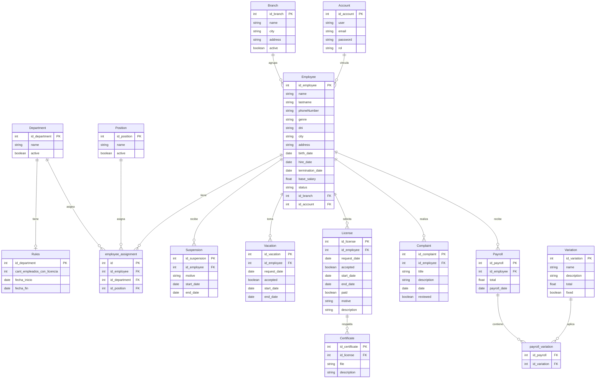

```mermaid

erDiagram
Rules {
int id_department PK
int cant_empleados_con_licencia
date fecha_inicio
date fecha_fin
}

    Department {
        int id_department PK
        string name
        boolean active
    }

    employee_assignment {
        int id PK
        int id_employee FK
        int id_department FK
        int id_position FK
    }

    Position {
        int id_position PK
        string name
        boolean active
    }

    Suspension {
        int id_suspension PK
        int id_employee FK
        string motive
        date start_date
        date end_date
    }

    Vacation {
        int id_vacation PK
        int id_employee FK
        date request_date
        boolean accepted
        date start_date
        date end_date
    }

    Employee {
        int id_employee PK
        string name
        string lastname
        string phoneNumber
        string genre
        string dni
        string city
        string address
        date birth_date
        date hire_date
        date termination_date
        float base_salary
        string status
        int id_branch FK
        int id_account FK
    }

    License {
        int id_license PK
        int id_employee FK
        date request_date
        boolean accepted
        date start_date
        date end_date
        boolean paid
        string motive
        string description
    }

    Certificate {
        int id_certificate PK
        int id_license FK
        string file
        string description
    }

    Complaint {
        int id_complaint PK
        int id_employee FK
        string title
        string description
        date date
        boolean reviewed
    }

    Payroll {
        int id_payroll PK
        int id_employee FK
        float total
        date payroll_date
    }

    payroll_variation {
        int id_payroll FK
        int id_variation FK
    }

    Variation {
        int id_variation PK
        string name
        string description
        float total
        boolean fixed
    }

    Branch {
        int id_branch PK
        string name
        string city
        string address
        boolean active
    }

    Account {
        int id_account PK
        string user
        string email
        string password
        string rol
    }

    %% Relaciones
    Department ||--o| Rules : "tiene"
    Department ||--o{ employee_assignment : "asigna"
    Position ||--o{ employee_assignment : "asigna"
    Employee ||--o{ employee_assignment : "tiene"
    
    Employee ||--o{ Suspension : "recibe"
    Employee ||--o{ Vacation : "toma"
    Employee ||--o{ License : "solicita"
    License ||--o{ Certificate : "respalda"
    
    Employee ||--o{ Complaint : "realiza"
    
    Branch ||--o{ Employee : "agrupa"
    Account ||--o{ Employee : "vincula"
    
    Employee ||--o{ Payroll : "recibe"
    Payroll ||--o{ payroll_variation : "contiene"
    Variation ||--o{ payroll_variation : "aplica"
```